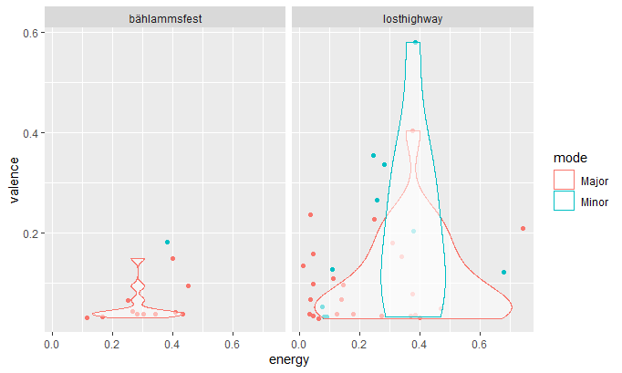
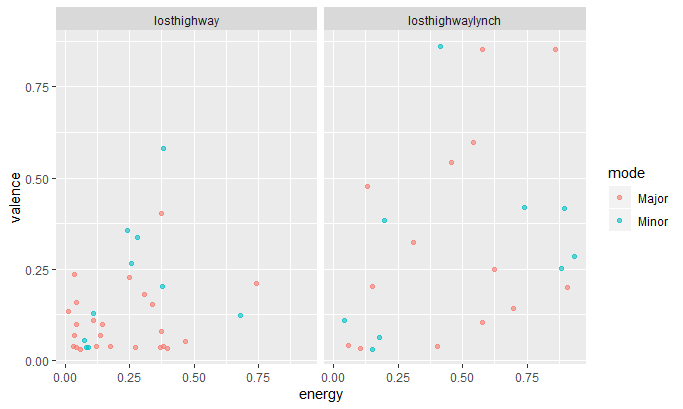

```{r setup}
# In order to use these packages, we need to install flexdashboard, plotly, and Cairo.
library(tidyverse)
library(plotly)
library(spotifyr)
```


### introduction
#### last semester i had a seminar about olga neuwirth - a contemporary composer - and a friend of mine had the critic that "every song sounds the same"
#### i want to analyse if the features of her songs are the same or not and if they are not the same i want to take a look on how they changed by time
#### futhermore i want to analyse the character of her music in general - does the features of her music represent her personal character?  the texts we read about her in the seminar assumed this - the primary focus for this lies on the valence and energy of her compositions - she is a very depressed person amongst other things based on an accident she had when she was fifteen years old - she wanted to be a jazz trumpeter but because of this accident she was not able to play the trumpet anymore - so she "took the burdon" to become a componist and shows this depression in her music - she has several aspects in her personality which i wanna "search" in her music - for example: she claims that it is hard for women to be a componist - to be taken serious in this business - so she sets statements with the content of her works - i wanna look if this power is shown in her music
#### so for this i wanna take a look at the features of all her works i can find on spotify and how these matches her personality (especially focused on valence, energy and loudness) - futhermore i wanna compare her own works with each other and - last but not least - her work *lost highway* (which is based on the film *lost highway* by david lynch) with a playlist based on the film music of *lost highway* by david lynch - here i wanna see how the valence and energy was changed by her compared to the "original" - so i analyse how works that already exists are changed by her with her own character

### plots
#### these are two compositions from her compared in valence and energy:


#### -> this shows the aspect of the depression in her compositions very clear

***
#### i also compared the playlist of her work of *lost highway* with a playlist based on the film music of *lost highway* by david lynch - i also focused on the valence of the songs which are used/composed for each work

#### -> this shows how she add her personal character to a work that already exists


