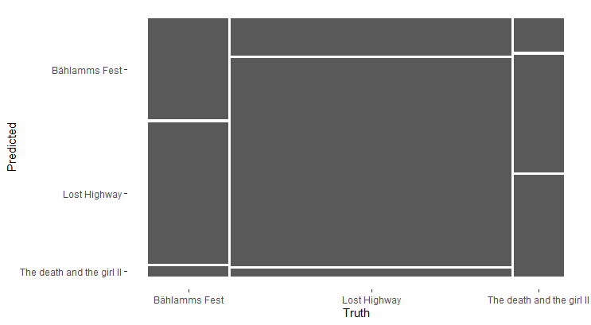
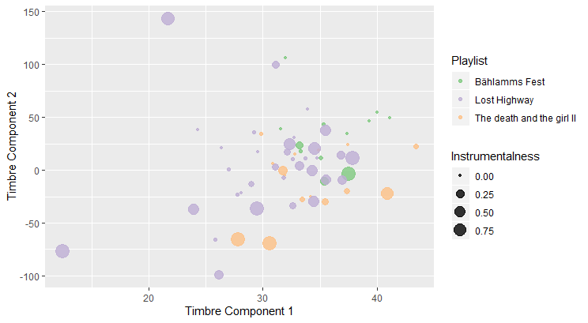
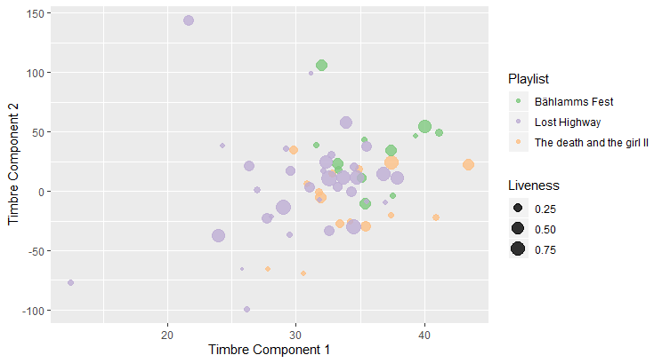

```{r setup}
# In order to use these packages, we need to install flexdashboard, plotly, and Cairo.
library(tidyverse)
library(plotly)
library(compmus)
library(spotifyr)
```

### May I introduce to you: Olga Neuwirth

Last semester I had a seminar about Olga Neuwirth - a contemporary composer from austria - and a friend of mine had the critique that "every song sounds the same". So I had the idea to analyze the features of her songs. I want to analyze the character of her music and compare this with the character of her personality. Does the features of her music represent her personal character? - The texts we read about her in the seminar assumed this.

The primary focus for this lies on the valence and energy of her compositions because she is a very depressed person among other things based on an accident she had when she was fifteen years old. She actually wanted to be a jazz trumpeter but because of this accident she was not able to play the trumpet anymore. So she "took the burden" to become a componist and shows this depression in her music.

But beside her depression, which is definitely the biggest part, she has several aspects in her personality which I want to "search" in her music. For example has she a very determined and strong character. She claims a lot that it is hard for women to be a componist - to be taken serious in this business. So she sets statements with the content of her works. In the past she was denied by several institutions but in 2019 she was the first female componist which presented an opera at the *Vienna State Opera*. I want to look if this power and energy is shown in her music, too. So for this I want to take a look at the features of all her works I can find on Spotify and how these matches her personality (especially focused on valence, energy, loudness & speechiness).

Furthermore I want to compare her own works with each other and - last but not least - her work *Lost Highway* (which is based on the film *Lost Highway* by David Lynch) with a playlist based on the film music of *Lost Highway* by David Lynch. Here I want to take a look on how the valence and energy was changed by her compared to the "original" - so I analyze how she may adds her personality to works that already exists.

#### Summarize of what I want to do
* comparison of all her songs I find on Spotify
    + are there songs that are standing out? -> if yes, how?
    + what is the mean character of her music in general?
* how matches her music her personality?
    + does she show her depression in her music? -> which features show this?
    + does she show her strong determined character in her music? -> which features show this?
    
***


### The mood of her music

```{r}
olganeuwirth <- get_playlist_audio_features('applejackey', '3ct4SKi3r2IvsMnPYorsSN')

olganeuwirth %>% mutate(mode = ifelse(mode == 0, 'Minor', 'Major')) %>% ggplot(aes(x = energy, y = valence, colour = mode)) + geom_point(alpha = 0.6) + theme_classic()

general <- olganeuwirth %>% mutate(mode = ifelse(mode == 0, 'Minor', 'Major')) %>% ggplot(aes(x = energy, y = valence, colour = mode, label = track.name)) + geom_point(alpha = 0.6) + theme_classic()

ggplotly(general)
```

***

This is an overview of all songs (100) from Olga Neuwirth I found on Spotify. It shows very clearly that her music in general has a very low valence - with a few exceptions. This matches the aspect of her depressed personality. 
As this plot shows there is an outlier song with a very high valence - this song is ironically from her composition *the death and the girl II*. Although this song has a high valence the "sadness" is represented in the title. So it does not matter if a song of her is "happy" or not, the depressed mood is always present in a way.
The song with lowest valence of all of her songs is also from the composition *the death and the girl II* - so this composition has the highest valence distance.

### The mood of her music in keygrams (the happiest vs. the saddest)

```{r}
circshift <- function(v, n) {if (n == 0) v else c(tail(v, n), head(v, -n))}
                                    
    # C     C#    D     Eb    E     F     F#    G     Ab    A     Bb    B 
major_chord <- 
    c(1,    0,    0,    0,    1,    0,    0,    1,    0,    0,    0,    0)
minor_chord <- 
    c(1,    0,    0,    1,    0,    0,    0,    1,    0,    0,    0,    0)
seventh_chord <- 
    c(1,    0,    0,    0,    1,    0,    0,    1,    0,    0,    1,    0)

major_key <- 
    c(6.35, 2.23, 3.48, 2.33, 4.38, 4.09, 2.52, 5.19, 2.39, 3.66, 2.29, 2.88)
minor_key <-
    c(6.33, 2.68, 3.52, 5.38, 2.60, 3.53, 2.54, 4.75, 3.98, 2.69, 3.34, 3.17)

chord_templates <-
    tribble(
        ~name  , ~template,
        'Gb:7'  , circshift(seventh_chord,  6),
        'Gb:maj', circshift(major_chord,    6),
        'Bb:min', circshift(minor_chord,   10),
        'Db:maj', circshift(major_chord,    1),
        'F:min' , circshift(minor_chord,    5),
        'Ab:7'  , circshift(seventh_chord,  8),
        'Ab:maj', circshift(major_chord,    8),
        'C:min' , circshift(minor_chord,    0),
        'Eb:7'  , circshift(seventh_chord,  3),
        'Eb:maj', circshift(major_chord,    3),
        'G:min' , circshift(minor_chord,    7),
        'Bb:7'  , circshift(seventh_chord, 10),
        'Bb:maj', circshift(major_chord,   10),
        'D:min' , circshift(minor_chord,    2),
        'F:7'   , circshift(seventh_chord,  5),
        'F:maj' , circshift(major_chord,    5),
        'A:min' , circshift(minor_chord,    9),
        'C:7'   , circshift(seventh_chord,  0),
        'C:maj' , circshift(major_chord,    0),
        'E:min' , circshift(minor_chord,    4),
        'G:7'   , circshift(seventh_chord,  7),
        'G:maj' , circshift(major_chord,    7),
        'B:min' , circshift(minor_chord,   11),
        'D:7'   , circshift(seventh_chord,  2),
        'D:maj' , circshift(major_chord,    2),
        'F#:min', circshift(minor_chord,    6),
        'A:7'   , circshift(seventh_chord,  9),
        'A:maj' , circshift(major_chord,    9),
        'C#:min', circshift(minor_chord,    1),
        'E:7'   , circshift(seventh_chord,  4),
        'E:maj' , circshift(major_chord,    4),
        'G#:min', circshift(minor_chord,    8),
        'B:7'   , circshift(seventh_chord, 11),
        'B:maj' , circshift(major_chord,   11),
        'D#:min', circshift(minor_chord,    3))

key_templates <-
    tribble(
        ~name    , ~template,
        'Gb:maj', circshift(major_key,  6),
        'Bb:min', circshift(minor_key, 10),
        'Db:maj', circshift(major_key,  1),
        'F:min' , circshift(minor_key,  5),
        'Ab:maj', circshift(major_key,  8),
        'C:min' , circshift(minor_key,  0),
        'Eb:maj', circshift(major_key,  3),
        'G:min' , circshift(minor_key,  7),
        'Bb:maj', circshift(major_key, 10),
        'D:min' , circshift(minor_key,  2),
        'F:maj' , circshift(major_key,  5),
        'A:min' , circshift(minor_key,  9),
        'C:maj' , circshift(major_key,  0),
        'E:min' , circshift(minor_key,  4),
        'G:maj' , circshift(major_key,  7),
        'B:min' , circshift(minor_key, 11),
        'D:maj' , circshift(major_key,  2),
        'F#:min', circshift(minor_key,  6),
        'A:maj' , circshift(major_key,  9),
        'C#:min', circshift(minor_key,  1),
        'E:maj' , circshift(major_key,  4),
        'G#:min', circshift(minor_key,  8),
        'B:maj' , circshift(major_key, 11),
        'D#:min', circshift(minor_key,  3))

happy <- 
    get_tidy_audio_analysis('5Zh7XZqTsYDuriSNqpnbBK') %>% 
    compmus_align(sections, segments) %>% 
    select(sections) %>% unnest(sections) %>% 
    mutate(
        pitches = 
            map(segments, 
                compmus_summarise, pitches, 
                method = 'mean', norm = 'manhattan'))

happy %>% 
    compmus_match_pitch_template(key_templates, 'euclidean', 'manhattan') %>% 
    ggplot(
        aes(x = start + duration / 2, width = duration, y = name, fill = d)) +
    geom_tile() +
    scale_fill_viridis_c(option = 'E', guide = 'none') +
    theme_minimal() +
    labs(x = 'Time (s)', y = '')

sad <- 
    get_tidy_audio_analysis('0ol6vgtY8Wapli7sr663QQ') %>% 
    compmus_align(sections, segments) %>% 
    select(sections) %>% unnest(sections) %>% 
    mutate(
        pitches = 
            map(segments, 
                compmus_summarise, pitches, 
                method = 'mean', norm = 'manhattan'))

sad %>% 
    compmus_match_pitch_template(key_templates, 'euclidean', 'manhattan') %>% 
    ggplot(
        aes(x = start + duration / 2, width = duration, y = name, fill = d)) +
    geom_tile() +
    scale_fill_viridis_c(option = 'E', guide = 'none') +
    theme_minimal() +
    labs(x = 'Time (s)', y = '')
```

***

These two keygrams show the outlier of her music, the song with the highest valence, and the song with the lowest valence which is not an outlier because almost every song has such a low valence.
Both songs are from the composition *the death and the girl II*.
Only by looking at the keygrams (without any background information) it is clear that these two songs could be pretty much the opposite of each other.

The first keygram shows the happiest song with a valence of ~0.6890 (mode = 1, key = 1). (Scene 11 of *the death and the girl II*)
In this song you hear the entire time a computational voice which speaks over the instruments. I guess that this is why almost the whole keygram is highlighted. I think the voice makes it hard to determine the key. At the dark spot ~110 seconds the voice is not speaking.

The second keygram shows the saddest song with a valence of ~0.0202 (mode = 1, key = 0). (Scene 15 of *the death and the girl II* )
The highlighted spots show that there is almost no key. In this sections you only hear a high "out of space" tone, like glass sounds. When the tone in the song gets lower/darker, the keygram gets darker as well.

The happiest song is composed in major and the saddest in minor which is a "determined thing in music theory" that major sounds happy and minor sounds sad. I would had expected that her happiest song is for example composed in minor so the depressed aspect in her music would not only be present in the title (see "The mood of her music") but also in the key. But I guess that in this case the valence would be lower analyzed by Spotifyr (?).

### Novelty function (happiest vs. saddest song of all her music)

```{r}
 happy <- 
     get_tidy_audio_analysis('5Zh7XZqTsYDuriSNqpnbBK') %>% 
     select(segments) %>% unnest(segments)
 happy %>% 
     mutate(loudness_max_time = start + loudness_max_time) %>% 
     arrange(loudness_max_time) %>% 
     mutate(delta_loudness = loudness_max - lag(loudness_max)) %>% 
     ggplot(aes(x = loudness_max_time, y = pmax(0, delta_loudness))) +
     geom_line() +
     xlim(0, 30) +
     theme_minimal() +
     labs(x = 'Time (s)', y = 'Novelty')
 
  sad <- 
     get_tidy_audio_analysis('0ol6vgtY8Wapli7sr663QQ') %>% 
     select(segments) %>% unnest(segments)
 sad %>% 
     mutate(loudness_max_time = start + loudness_max_time) %>% 
     arrange(loudness_max_time) %>% 
     mutate(delta_loudness = loudness_max - lag(loudness_max)) %>% 
     ggplot(aes(x = loudness_max_time, y = pmax(0, delta_loudness))) +
     geom_line() +
     xlim(0, 30) +
     theme_minimal() +
     labs(x = 'Time (s)', y = 'Novelty')
```

***

Novelty function of 1. the happiest and 2. the saddest of all her composed songs (I found on Spotify). At first it seems that you can clearly see the difference of these two songs which are, focused on valence, the most different songs compared to each other. But this is not true. If you take a closer look on the scale you see that both songs are not that different. Because of single parts which really stands out at the first song (over 10) the scale is different from the second one and it seems that the difference between them is bigger than it actually is.

### Tempo & Chaos - happy, sad & something inbetween

```{r}
happy <- get_tidy_audio_analysis('5Zh7XZqTsYDuriSNqpnbBK')

happy %>% 
    tempogram(window_size = 4, hop_size = 1, cyclic = FALSE) %>% 
    ggplot(aes(x = time, y = bpm, fill = power)) + 
    geom_raster() + 
    scale_fill_viridis_c(guide = 'none') +
    labs(x = 'Time (s)', y = 'Tempo (BPM)') +
    theme_classic()

 sad <- get_tidy_audio_analysis('0ol6vgtY8Wapli7sr663QQ')
 sad %>% 
     tempogram(window_size = 4, hop_size = 1, cyclic = FALSE) %>% 
     ggplot(aes(x = time, y = bpm, fill = power)) + 
     geom_raster() + 
     scale_fill_viridis_c(guide = 'none') +
     labs(x = 'Time (s)', y = 'Tempo (BPM)') +
     theme_classic()
 
 scene6 <- get_tidy_audio_analysis('2smcNkJgajjvTnyvxLl9xH')

 scene6 %>% 
     tempogram(window_size = 4, hop_size = 1, cyclic = FALSE) %>% 
     ggplot(aes(x = time, y = bpm, fill = power)) + 
     geom_raster() + 
     scale_fill_viridis_c(guide = 'none') +
     labs(x = 'Time (s)', y = 'Tempo (BPM)') +
     theme_classic()
```

***

In advance: yes, I tried different methods to plot this. I am very sure that the songs she composed are not suitable for this kind of analysis - but anyways it is very interesting especially regarding to her working method!

These three tempograms of 1. the happiest, 2. the saddest of all her composed songs (I found on Spotify) and 3. the song with the lowest valence from her composition *Lost Highway* show that her music is not that good to be visualized in a tempogram. It looks very chaotic and says nothing what it should be say about the songs. Nonetheless it is interesting to see how the tempograms try to handle this. 

The last tempogram (the song from *Lost Highway*) is chaotic as the other two songs but around 150 seconds the tempo gets clear for a moment. This is because this is the only part of the song where are used "clear" instruments without a voice speaking. The rest of the song is a voice speaking (not exactly singing) or there are "out of space" sounds like glass sounds or a voice holding one high note straight. This is probably why the tempogram cannot determine a clear tempo except of this part. 
(Look at the tab "Comparison of Chroma, Cepsto-, Tempo- & Keygram" where I compared these three -grams with each other for a closer look at this song)

__Her motivation & working method__

Anyways is this chaos very interesting regarding to her working methods. The modes of perception shaped by mainstream images and sounds, such as looking from a central perspective or passive listening, which are all too often assisted by language that conveys meaning as a hermeneutic adjusting screw, motivates her methodological interest in the deconstruction of perception. Olga Neuwirth surely works with "real instrument sounds" but often (I'm not sure if it is in every of her works, but I guess) she detunes instruments, uses (detuned) children instruments or works with sound morphing. With this sound morphing she creates so called "hybrid sounds" where she mixes sounds from different instruments to a new one. This leads to "confusion" in hearing what she definitely wants to create.
According to Olga Neuwirth, disorientation and confusion are no states of negative connotation, but rather perceptual effects that are deliberately aimed for. Thus she consciously confronts the audience with the seemingly strange, which in its initial discomfort wants to result in an even more productive experience.

This confusion and the resulting chaos could be seen as visualized through this tempograms even if they are not connected in any way.

### What is "happy" for her is "depressed" for others

```{r}
bählammsfest <- get_playlist_audio_features('applejackey', '0S7AN9KBAM2uBorb7p5okC')
losthighway <- get_playlist_audio_features('applejackey', '0rpE8eKsaal3ovP4TAYNgZ')

compositions <-
bählammsfest %>% mutate(playlist = "BählammsFest") %>%
bind_rows(losthighway %>% mutate(playlist = "LostHighway"))

sad <- compositions %>% mutate(mode = ifelse(mode == 0, 'Minor', 'Major')) %>% ggplot(aes(x = energy, y = valence, colour = mode, label = track.name)) + geom_point(alpha = 0.6) + facet_wrap( ~ playlist_name) + theme_minimal()

ggplotly(sad)
```

***

The comparison of Olga Neuwirths compositions *Bählamms Fest* and *Lost Highway* in valence and energy shows that *Lost Highway* is "much more" happier than *Bählamms Fest* (and her music in general - see "The mood of her music"). This could be because *Lost Highway* is based on a film with a story that already existed. So she "had to obey some rules" for this composition.
That she nonetheless put her character in this composition shows the comparison between her composed music for *Lost Highway* and the used music in the film *Lost Highway* by David Lynch (see "Lost Highway - comparison to "the original"")

### Lost Highway - comparison to "the original"

```{r}
losthighway <- get_playlist_audio_features('applejackey', '0rpE8eKsaal3ovP4TAYNgZ')
losthighwaylynch <- get_playlist_audio_features('applejackey', '48trfaA2jPoNdOgctI02Jc')

comparison <-
losthighway %>% mutate(playlist = "LostHighway") %>%
bind_rows(losthighwaylynch %>% mutate(playlist = "LostHighwayLynch"))

compare <- comparison %>% mutate(mode = ifelse(mode == 0, 'Minor', 'Major')) %>% ggplot(aes(x = energy, y = valence, colour = mode, label = track.name)) + geom_point(alpha = 0.6) + facet_wrap( ~ playlist_name) + theme_minimal()

ggplotly(compare)
```

***

Comparison between the playlist of her work of *Lost Highway* and a playlist based on the film music of *Lost Highway* by David Lynch - the focus is also on the valence of the songs which are used/composed for each work.

This shows how she adds her personal character to a work that already exists. The valence is much more lower in her work. What in the last tab looked actually really happy compared to *Bählamms Fest* is nonetheless very depressed. Especially compared to the original film music.

### Comparison of Chroma-, Cepsto-, Tempo- & Keygram

```{r}

scene6 <- 
    get_tidy_audio_analysis('2smcNkJgajjvTnyvxLl9xH') %>% 
    select(segments) %>% unnest(segments) %>% 
    select(start, duration, pitches)

scene6 %>% 
    mutate(pitches = map(pitches, compmus_normalise, 'euclidean')) %>% 
    compmus_gather_chroma %>% 
    ggplot(
        aes(
            x = start + duration / 2, 
            width = duration, 
            y = pitch_class, 
            fill = value)) + 
    geom_tile() +
    labs(x = 'time (s)', y = NULL, fill = 'magnitude') +
    theme_minimal()

scene6 <- 
    get_tidy_audio_analysis('2smcNkJgajjvTnyvxLl9xH') %>% 
    compmus_align(beats, segments) %>% 
    select(beats) %>% unnest(beats) %>% 
    mutate(
        pitches = 
            map(segments, 
                compmus_summarise, pitches, 
                method = 'rms', norm = 'euclidean')) %>% 
    mutate(
        timbre = 
            map(segments, 
                compmus_summarise, timbre, 
                method = 'rms', norm = 'euclidean'))

scene6 %>% 
    compmus_gather_timbre %>% 
    ggplot(
        aes(
            x = start + duration / 2, 
            width = duration, 
            y = basis, 
            fill = value)) + 
    geom_tile() +
    labs(x = 'Time (s)', y = NULL, fill = 'Magnitude') +
    scale_fill_viridis_c(option = 'E') +
    theme_classic()

 scene6 <- get_tidy_audio_analysis('2smcNkJgajjvTnyvxLl9xH')

 scene6 %>% 
     tempogram(window_size = 4, hop_size = 1, cyclic = FALSE) %>% 
     ggplot(aes(x = time, y = bpm, fill = power)) + 
     geom_raster() + 
     scale_fill_viridis_c(guide = 'none') +
     labs(x = 'Time (s)', y = 'Tempo (BPM)') +
     theme_classic()
 
 circshift <- function(v, n) {if (n == 0) v else c(tail(v, n), head(v, -n))}
                                    
    # C     C#    D     Eb    E     F     F#    G     Ab    A     Bb    B 
major_chord <- 
    c(1,    0,    0,    0,    1,    0,    0,    1,    0,    0,    0,    0)
minor_chord <- 
    c(1,    0,    0,    1,    0,    0,    0,    1,    0,    0,    0,    0)
seventh_chord <- 
    c(1,    0,    0,    0,    1,    0,    0,    1,    0,    0,    1,    0)

major_key <- 
    c(6.35, 2.23, 3.48, 2.33, 4.38, 4.09, 2.52, 5.19, 2.39, 3.66, 2.29, 2.88)
minor_key <-
    c(6.33, 2.68, 3.52, 5.38, 2.60, 3.53, 2.54, 4.75, 3.98, 2.69, 3.34, 3.17)

chord_templates <-
    tribble(
        ~name  , ~template,
        'Gb:7'  , circshift(seventh_chord,  6),
        'Gb:maj', circshift(major_chord,    6),
        'Bb:min', circshift(minor_chord,   10),
        'Db:maj', circshift(major_chord,    1),
        'F:min' , circshift(minor_chord,    5),
        'Ab:7'  , circshift(seventh_chord,  8),
        'Ab:maj', circshift(major_chord,    8),
        'C:min' , circshift(minor_chord,    0),
        'Eb:7'  , circshift(seventh_chord,  3),
        'Eb:maj', circshift(major_chord,    3),
        'G:min' , circshift(minor_chord,    7),
        'Bb:7'  , circshift(seventh_chord, 10),
        'Bb:maj', circshift(major_chord,   10),
        'D:min' , circshift(minor_chord,    2),
        'F:7'   , circshift(seventh_chord,  5),
        'F:maj' , circshift(major_chord,    5),
        'A:min' , circshift(minor_chord,    9),
        'C:7'   , circshift(seventh_chord,  0),
        'C:maj' , circshift(major_chord,    0),
        'E:min' , circshift(minor_chord,    4),
        'G:7'   , circshift(seventh_chord,  7),
        'G:maj' , circshift(major_chord,    7),
        'B:min' , circshift(minor_chord,   11),
        'D:7'   , circshift(seventh_chord,  2),
        'D:maj' , circshift(major_chord,    2),
        'F#:min', circshift(minor_chord,    6),
        'A:7'   , circshift(seventh_chord,  9),
        'A:maj' , circshift(major_chord,    9),
        'C#:min', circshift(minor_chord,    1),
        'E:7'   , circshift(seventh_chord,  4),
        'E:maj' , circshift(major_chord,    4),
        'G#:min', circshift(minor_chord,    8),
        'B:7'   , circshift(seventh_chord, 11),
        'B:maj' , circshift(major_chord,   11),
        'D#:min', circshift(minor_chord,    3))

key_templates <-
    tribble(
        ~name    , ~template,
        'Gb:maj', circshift(major_key,  6),
        'Bb:min', circshift(minor_key, 10),
        'Db:maj', circshift(major_key,  1),
        'F:min' , circshift(minor_key,  5),
        'Ab:maj', circshift(major_key,  8),
        'C:min' , circshift(minor_key,  0),
        'Eb:maj', circshift(major_key,  3),
        'G:min' , circshift(minor_key,  7),
        'Bb:maj', circshift(major_key, 10),
        'D:min' , circshift(minor_key,  2),
        'F:maj' , circshift(major_key,  5),
        'A:min' , circshift(minor_key,  9),
        'C:maj' , circshift(major_key,  0),
        'E:min' , circshift(minor_key,  4),
        'G:maj' , circshift(major_key,  7),
        'B:min' , circshift(minor_key, 11),
        'D:maj' , circshift(major_key,  2),
        'F#:min', circshift(minor_key,  6),
        'A:maj' , circshift(major_key,  9),
        'C#:min', circshift(minor_key,  1),
        'E:maj' , circshift(major_key,  4),
        'G#:min', circshift(minor_key,  8),
        'B:maj' , circshift(major_key, 11),
        'D#:min', circshift(minor_key,  3))

scene6 <- 
    get_tidy_audio_analysis('2smcNkJgajjvTnyvxLl9xH') %>% 
    compmus_align(sections, segments) %>% 
    select(sections) %>% unnest(sections) %>% 
    mutate(
        pitches = 
            map(segments, 
                compmus_summarise, pitches, 
                method = 'mean', norm = 'manhattan'))

scene6 %>% 
    compmus_match_pitch_template(key_templates, 'euclidean', 'manhattan') %>% 
    ggplot(
        aes(x = start + duration / 2, width = duration, y = name, fill = d)) +
    geom_tile() +
    scale_fill_viridis_c(option = 'E', guide = 'none') +
    theme_minimal() +
    labs(x = 'Time (s)', y = '')
```

***

This is a comparison of the Chroma-, Cepsto-, Tempo- & Keygram of the song with the lowest valence of the composition *Lost Highway* from Olga Neuwirth.

These clearly show that the part around 150 sec. is different from the rest of the song. This is because these ~30 sec. are the only part where "clear" instrument sounds are used without a voice speaking over them. The rest of the song are kinda "out of space" noises and sounds which the -grams cannot handle properly. It is the same problem as by the tempograms before. (see "Tempograms - happy, sad & something inbetween")

The Keygram also shows that something happens in the song at ~50 sec. and ~130 sec. In this parts the song almost have no key. This is because in this sections there is only a voice to hear which holds on one single tone (almost no instruments). So I guess that this is not enough to identify a key.


### Self similarity matrice (The song with the lowest valence in *Lost Highway* (mode = 1, key = 8))

```{r}
scene6 <- 
    get_tidy_audio_analysis('2smcNkJgajjvTnyvxLl9xH') %>% 
    compmus_align(bars, segments) %>% 
    select(bars) %>% unnest(bars) %>% 
    mutate(
        pitches = 
            map(segments, 
                compmus_summarise, pitches, 
                method = 'rms', norm = 'euclidean')) %>% 
    mutate(
        timbre = 
            map(segments, 
                compmus_summarise, timbre, 
                method = 'rms', norm = 'euclidean'))

song <- scene6 %>% 
    compmus_self_similarity(timbre, 'cosine') %>% 
    ggplot(
        aes(
            x = xstart + xduration / 2, 
            width = xduration,
            y = ystart + yduration / 2,
            height = yduration,
            fill = d)) + 
    geom_tile() +
    coord_fixed() +
    scale_fill_viridis_c(option = 'E', guide = 'none') +
    theme_classic() +
    labs(x = '', y = '')

ggplotly(song)
```

***

This is the self-similarity matrice of the song with the lowest valence from Olga Neuwirths composition *Lost Highway*.

### Did you say something? - The voice of her music

```{r}
olganeuwirth <- get_playlist_audio_features('applejackey', '3ct4SKi3r2IvsMnPYorsSN')

olganeuwirth %>% mutate(mode = ifelse(mode == 0, 'Minor', 'Major')) %>% ggplot(aes(x = speechiness, y = loudness, colour = mode)) + geom_point(alpha = 0.6) + theme_classic()

general2 <- olganeuwirth %>% mutate(mode = ifelse(mode == 0, 'Minor', 'Major')) %>% ggplot(aes(x = speechiness, y = loudness, colour = mode, label = track.name)) + geom_point(alpha = 0.6) + theme_classic()

ggplotly(general2)
```

***

This is an overview of all songs (100) from Olga Neuwirth I found on Spotify. This time with a focus on loud- & speechiness.
Two things that I have expected for this plot:
1. For this to be musical performances on stage I thought that the speechiness would be higher.
2. I hoped that her music reflects her determined character through this features.

So in both cases I expected more power in her music focused on these features. The aspect with the low speechiness really surprised me so I want to take a closer look at the speechiness for single compositions (see "The voice in a closeup").


### The voice in a closeup

```{r}
bählammsfest <- get_playlist_audio_features('applejackey', '0S7AN9KBAM2uBorb7p5okC')

bählammsfest %>% mutate(mode = ifelse(mode == 0, 'Minor', 'Major')) %>% ggplot(aes(x = speechiness, y = loudness, colour = mode)) + geom_point() + theme_bw() + labs(title = "Bählamms Fest", subtitle = "(1999)", caption = "animation-opera")

dertodunddasmädchenII <- get_playlist_audio_features('applejackey', '4XW6Ch7smd3Ngwh7RNQmck')

dertodunddasmädchenII %>% mutate(mode = ifelse(mode == 0, 'Minor', 'Major')) %>% ggplot(aes(x = speechiness, y = loudness, colour = mode)) + geom_point() + theme_bw() + labs(title = "The death and the girl II", subtitle = "(2000)", caption = "audio piece based on a text by Elfriede Jelinek")

losthighway <- get_playlist_audio_features('applejackey', '0rpE8eKsaal3ovP4TAYNgZ')

losthighway %>% mutate(mode = ifelse(mode == 0, 'Minor', 'Major')) %>% ggplot(aes(x = speechiness, y = loudness, colour = mode)) + geom_point() + theme_bw() + labs(title = "Lost Highway", subtitle = "(2003)", caption = "video-opera")

goodnightmommy <- get_playlist_audio_features('applejackey', '6cZmLiip5N2zcJCbL7blFu')

goodnightmommy %>% mutate(mode = ifelse(mode == 0, 'Minor', 'Major')) %>% ggplot(aes(x = speechiness, y = loudness, colour = mode)) + geom_point() + theme_bw() + labs(title = "Goodnight Mommy", subtitle = "(2016)", caption = "original motion picture soundtrack to *Goodnight Mommy*")
```

***

I expected her compositions to be more speechy in general due to the fact that these are musical performances on stage, expect of *Goodnight Mommy*. 
Nonetheless, the analyzing of the speechiness shows something very interesting. The plots compared to each other show clearly that the speechiness always follows the same structure. In each case there is exactly one outlier which is way more speechy than the other songs. Also the speechiness of these outliers and in general is almost the same in each composition except from *Goodnight Mommy*. But this exception makes sense because the first three compositions are for musical performances on stage and *Goodnight Mommy* is a soundtrack album for a film.

### Relationship of three compositions





***

The Relationship between three of Olga Neuwirths compositions - Bählamms Fest, Lost Highway and The death and the girl II.

The confusion matrix shows that *Lost Highway* is much more different than *Bählamms Fest* and *The girl and the death II*. This also matches the fact that *Lost Highway* is based on a already existing work. That this composition is an outlier already show the tabs "What is "happy" for her is "depressed" for others" and "Lost Highway - comparison to "the original"".

__Instrumentalness__

It is interesting to see that for the instrumentalness there is either a huge instrumentalness (0.75) or none (0.00). There is almost no inbetween. But regarding to the fact that these are all songs from "operas" (she does not call her works opera but she has for almost every of her works a different "genre name") it is not surprisingly. Either there is someone singing/talking during a scene or there is only music/sounds/noises during for example a scene that could be interpreted as an interlude or something similar.

__Liveness__

For the liveness I have guessed that every song has to be in the range at least more than 0.5 because every composition I choosed (and I guess that is on Spotify anyways) is a recording from a live performance. So it surprised me that many songs not only from one but from all three compositions are analyzed with a very low liveness.
 
### Personality = Music?

After analyzing her music in general and several compositions in detail it becomes clear that the aspect of her depressed personality definitely shows up in her music. This shows especially the comparison between her interpretation of Lost Highway and the original by David Lynch. Her music is much more depressed than the original film music. But also the plot with all her songs (from Spotify) shows this. The valence is very low in general. Much more lower than I expected. I knew that she is depressed but this low valence surprised me, nonetheless.

I hoped to find the determined character of hers in features like loud- and speechiness but I must admit that I would not say that these are showing this aspect of her character like the valence reflects her depression.

But nonetheless I found something I was not looking for but I still admired in the seminar last semester: her compositions are so much well thought out. This is shown in her music scores where she also notes directions for the performers, sound and video engineers (it would be too much to describe this here but there are several aspects that fascinated me because they are so good thought out). Due this project her well thought out composing is clearly shown in the comparison of the loud- and speechiness of her compositions. Every composition follows almost the exact same pattern. The exception is *Goodnight Mommy* because this is a soundtrack album for a film. So this makes sense. The other three examples are for musical performances on stage. This fact and that the visualizations for these are looking so similar fascinating me again. I guess that she does not plot her songs before publishing them but it looks like this was intended to be compared and look like this. 

Additionally, I can say that her songs definitely are not sound the same. I listened to almost every song on Spotify due to this project. But this thinking also could be determined to individual perceptions and hearing habits which Olga Neuwirth wants to rearrange due confusion anyways. So I guess it is not that unusual that some would say that her music sounds the same. The same in confusing in any case. But this is what it makes her music and her in person so interesting. I also guess that this critique was on a personal aspect because I know that he does not like her music that much.