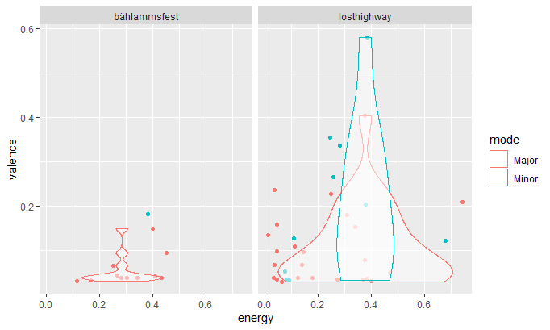
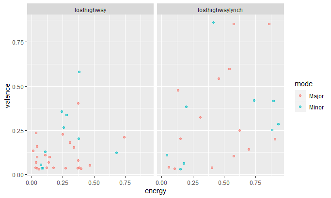

```{r setup}
# In order to use these packages, we need to install flexdashboard, plotly, and Cairo.
library(tidyverse)
library(plotly)
library(compmus)
library(spotifyr)
```


### May I introduce to you: Olga Neuwirth
Last semester I had a seminar about Olga Neuwirth - a contemporary composer from austria - and a friend of mine had the critic that "every song sounds the same". So I had the idea to analyze the features of her songs. I want to take a look if the features are the same or not and if they are not the same I want to take a look on how they changed by time.

Furthermore I want to analyse the character of her music in general.Does the features of her music represent her personal character? - The texts we read about her in the seminar assumed this.

The primary focus for this lies on the valence and energy of her compositions because she is a very depressed person among other things based on an accident she had when she was fifteen years old. She actually wanted to be a jazz trumpeter but because of this accident she was not able to play the trumpet anymore. So she "took the burden" to become a componist and shows this depression in her music.

But beside her depression she has several aspects in her personality which I want to "search" in her music. For example has she a very determined and strong character. She claims a lot that it is hard for women to be a componist - to be taken serious in this business. So she sets statements with the content of her works. In the past she was denied by several institutions but in 2019 she was the first female woman which presented an opera at the *Vienna State Opera*. I want to look if this power and energy is shown in her music, too. So for this I want to take a look at the features of all her works I can find on Spotify and how these matches her personality (especially focused on valence, energy and loudness).

Furthermore I want to compare her own works with each other and - last but not least - her work *Lost Highway* (which is based on the film *Lost Highway* by David Lynch) with a playlist based on the film music of *Lost Highway* by David Lynch. Here I want to take a look on how the valence and energy was changed by her compared to the "original" - so I analyse how works that already exists are changed by her with her own character.

#### Summarize of what I want to do
* comparison of all her songs I find on Spotify
    + are there songs that are standing out? -> if yes, how?
    + what is the mean character of her music in general?
* how matches her music her personality?
    + does she show her depression in her music? -> which features show this?
    + does she show her strong determined character in her music? -> which features show this?

### The mood of her music

#### **So here are the same plots not interactive for now**

#### Overview of the valence and energy of Olga Neuwirths compositions *Bählamms Fest* and *Lost Highway*



#### **-> This overview shows that the music Olga Neuwirth composes is very low in valence which matches the aspect of her depressed personality**
 


#### Comparison between the playlist of her work of *Lost Highway* and a playlist based on the film music of *Lost Highway* by David Lynch - the focus is also on the valence of the songs which are used/composed for each work



 
#### **-> This shows how she adds her personal character to a work that already exists**

### The mood of her music (interactive)

```{r}
bählammsfest <- get_playlist_audio_features('applejackey', '0S7AN9KBAM2uBorb7p5okC')
losthighway <- get_playlist_audio_features('applejackey', '0rpE8eKsaal3ovP4TAYNgZ')

compositions <-
bählammsfest %>% mutate(playlist = "BählammsFest") %>%
bind_rows(losthighway %>% mutate(playlist = "LostHighway"))

sad <- compositions %>% mutate(mode = ifelse(mode == 0, 'Minor', 'Major')) %>% ggplot(aes(x = energy, y = valence, colour = mode, label = track.name)) + geom_point(alpha = 0.6) + facet_wrap( ~ playlist_name)

ggplotly(sad)
```
 
***
Overview of the valence and energy of Olga Neuwirths compositions *Bählamms Fest* and *Lost Highway*

This overview shows that the music Olga Neuwirth composes is very low in valence which matches the aspect of her depressed personality

### The song with the lowest valence in *Lost Highway* (mode = 1, key = 8)

```{r}
scene6 <- 
    get_tidy_audio_analysis('2smcNkJgajjvTnyvxLl9xH') %>% 
    select(segments) %>% unnest(segments) %>% 
    select(start, duration, pitches)
```

```{r}
scene6 %>% 
    mutate(pitches = map(pitches, compmus_normalise, 'euclidean')) %>% 
    compmus_gather_chroma %>% 
    ggplot(
        aes(
            x = start + duration / 2, 
            width = duration, 
            y = pitch_class, 
            fill = value)) + 
    geom_tile() +
    labs(x = 'time (s)', y = NULL, fill = 'magnitude') +
    theme_minimal()
```

***

This song has the mode = 1 (so it is a song in major) and the key = 8 (so it is a song in g). It is also visible in the chromagram - but it is interesting that there are several highlighted spots in the chromagram which more or less are far away from the major g chord.

### Personality = Music?

After a first look at Olga Neuwirths compositions with a focus on the energy and valence it becomes clear that the aspect of her depressed personality definitely shows up in her music. This also shows the comparison between her interpretation of *Lost Highway* and the original by David Lynch. Her music is much more depressed than the original film music.

But the depression is not the only strong aspect of her personality. She also is a very determined character which I also want to search in her music. For this aspect I have to take a look at other compositions and features to search for features which could represent the other aspects of her personality - this will be my next step! And with this I analyze and summarize her music in general and give it an own summarized character/personality.

